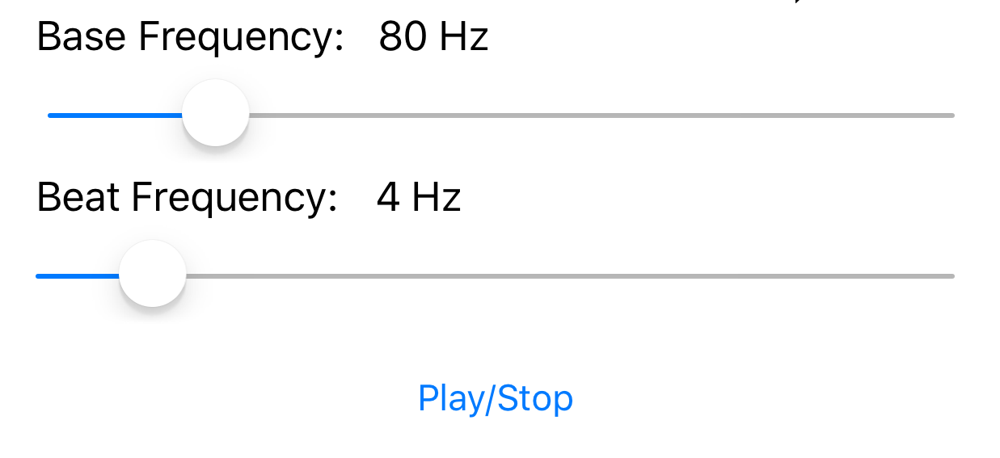

# Binaural Beats

The included Xcode project contains a working example that allows to generate any binaural beat from the user interface.



BinauralBeat is very easy to use class that plays a binaural beat given the base and beat frequencies.

#### Swift
```swift
let binauralBeat = BinauralBeat()
binauralBeat.baseFrequency = 80.0 // Hz
binauralBeat.beatFrequency = 4.0 // Hz
binauralBeat.play()
```

#### Objective-C
```objective-c
BinauralBeat *binauralBeat = [[BinauralBeat alloc] init];
binauralBeat.baseFrequency = 80.0 // Hz
binauralBeat.beatFrequency = 4.0 // Hz
[binauralBeat play];
```
